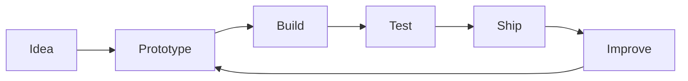

<div align="center">

# 👋 Hi, I'm Tony Nguyễn

### Developer • Builder • Problem Solver

<a href="https://new.id.vn/">
  
</a>
<a href="https://github.com/nguyenduytan">
  
</a>

<br><br>


</div>

---

## `$ whoami`

```bash
name     : Tony Nguyễn
role     : Developer / Builder
focus    : Web • Automation • Developer Tools
location : Vietnam
website  : https://new.id.vn
status   : Building, learning, shipping.
```

I enjoy turning ideas into practical tools, experimenting with new technologies, and building software that is simple, useful, and easy to use.

> **Code should solve problems — not create new ones.**

---

## `> tech --stack`

<div align="center">


</div>

---

## `> currently_building`

```text
[01] Browser extensions
[02] Automation tools
[03] Developer utilities
[04] Web experiments
[05] Open-source projects
```

My usual workflow is simple:



---

## `> github --stats`

<div align="center">


</div>

---

## `> philosophy`

```js
const mindset = {
  build: "things people can actually use",
  learn: "something new every day",
  optimize: "only after it works",
  share: "knowledge and open-source ideas",
  rule: "simple > complicated"
};
```

---

## `> connect`

<div align="center">

**Tony Nguyễn**

[](https://new.id.vn/)
[](https://github.com/nguyenduytan)

<br>

<sub>Built with ☕, curiosity, and probably too many browser tabs.</sub>

</div>
